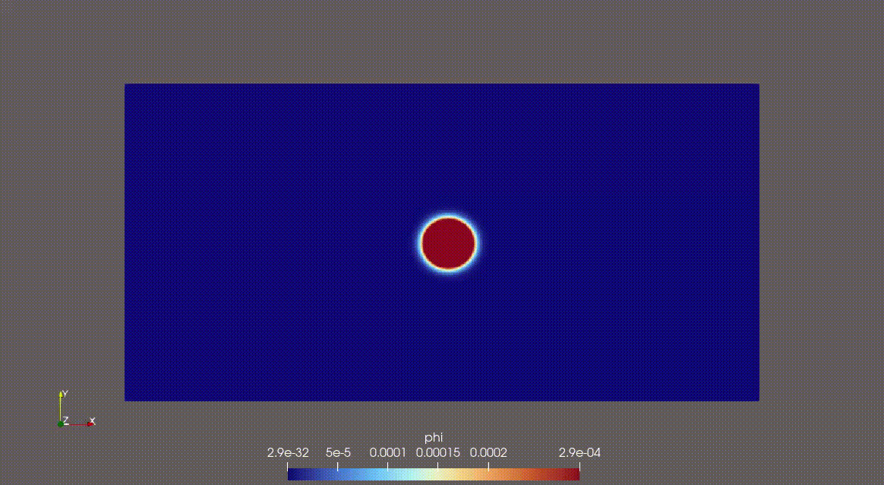

# 2D Advection Diffusion Solver 
Finite difference method (FDM) solver for 2D advection diffusion problems on a structured grid.

## Demo (GIF)

## Features
- Structured grid
- Boundary conditions handled with ghost cell application 
- Adaptive time step calculation 
- Numba parallelization of the stencil loop
- VTK output for ParaView

## Validation
- [High nu validation](validation_cases/inf_slab_high_nu.md)

## Requirements
- Python 3.9+
- numpy
- numba
- ParaView (for output visualization) 